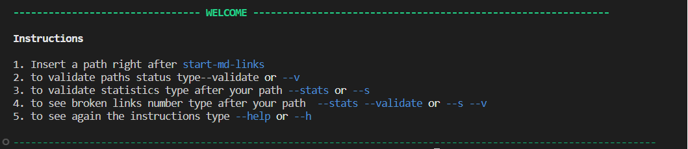
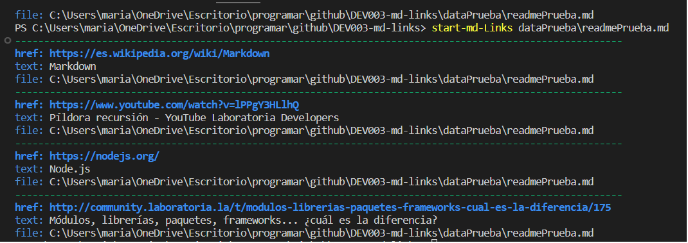
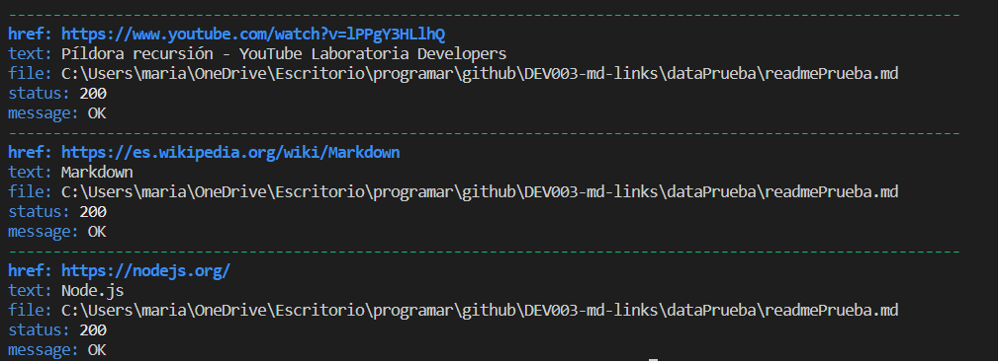
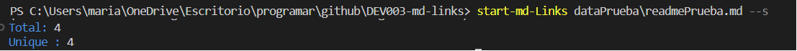
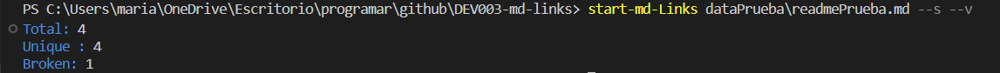

# Markdown Links

## Índice

* [1. Preámbulo](#1-preámbulo)
* [2. Resumen del proyecto](#2-resumen-del-proyecto)
* [3. Objetivos de aprendizaje](#3-instalación)
* [4. Consideraciones generales](#4-comandos)

***

## 1. Preámbulo

[Markdown](https://es.wikipedia.org/wiki/Markdown) es un lenguaje de marcado
ligero muy popular entre developers. Es usado en muchísimas plataformas que
manejan texto plano (GitHub, foros, blogs, ...) y es muy común
encontrar varios archivos en ese formato en cualquier tipo de repositorio
(empezando por el tradicional `README.md`).

Estos archivos `Markdown` normalmente contienen _links_ (vínculos/ligas) que
muchas veces están rotos o ya no son válidos y eso perjudica mucho el valor de
la información que se quiere compartir.

Dentro de una comunidad de código abierto, nos han propuesto crear una
herramienta usando [Node.js](https://nodejs.org/), que lea y analice archivos
en formato `Markdown`, para verificar los links que contengan y reportar
algunas estadísticas.

## 2. Resumen del proyecto

mdLinks es una libreria creada con NodeJS que permite verificar el estado de los enlaces que se encuentran en un archivo Markdown.

Esta biblioteca es útil para verificar si algunos de nuestros enlaces están repetidos, rotos o son inválidos.

## 3. Instalación

## 4. Comandos

En la terminal se ejecuta el comando 

start-md-Links

Para empezar a validar el path se inicia de la siguiente manera:

#### `start-md-Links <path-to-file> `

### Menú de ayuda

Para ver el menú de ayuda se debe ingresar `start-md-Links --help ` o `start-md-Links --h ` allí se verán todos las opciones disponibles

### Opciones

Al incertar la ruta a validar: `start-md-Links ./path-a-evaluar.md` nos mostrará las siguientes propiedas de cada link encontrado

Al ingresar el comando `start-md-Links --validate` o `start-md-Links --v ` se validará si el link funciona o no, como se muestra a continuación:

Con la opción `start-md-Links --stats` o `start-md-Links --s` obtendremos las estadísticas básicas sobre los links, como el número total de links y links únicos

Por último la opción combinada de `start-md-Links --stats --validate` o `start-md-Links --s --v` Obtendrás las estadísticas de los enlaces rotos

